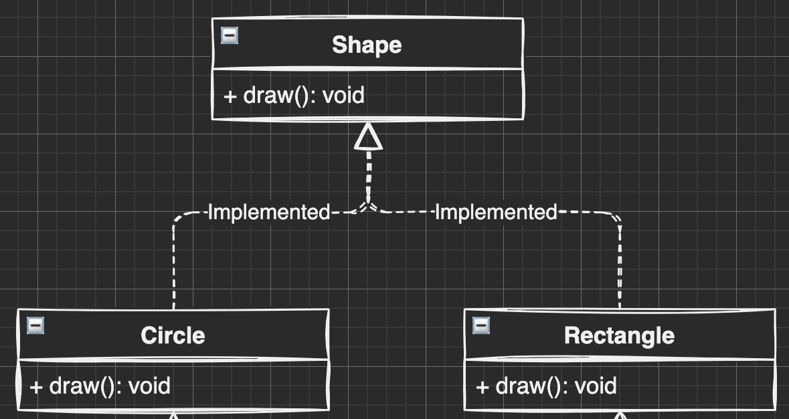
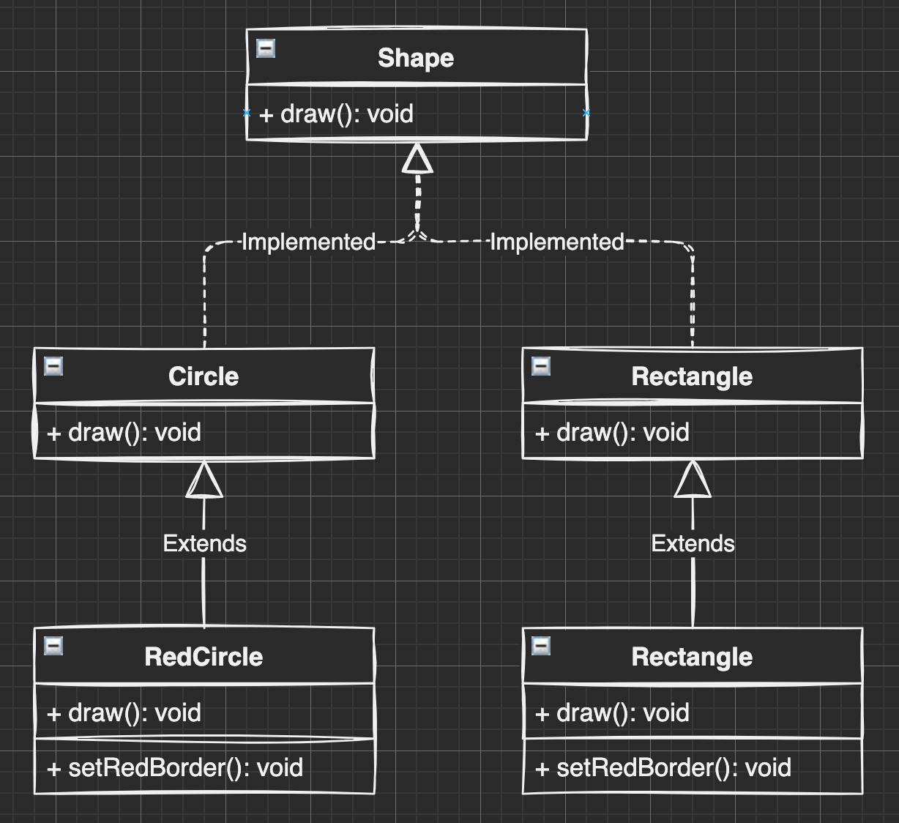
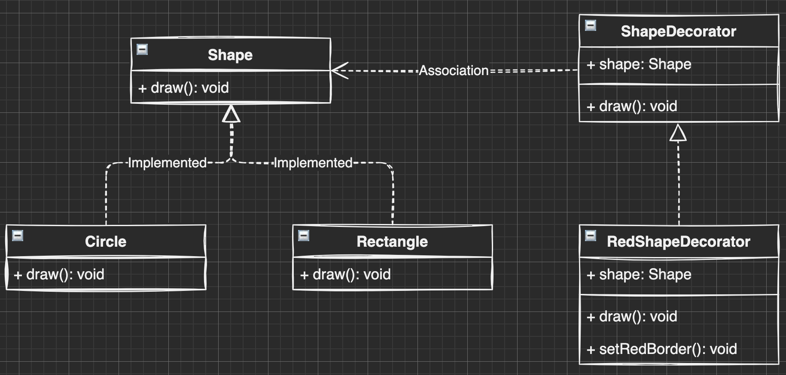

### 装饰器

1. 装饰器是什么
2. 装饰器解决了什么问题
3. 如何解决的问题

#### Ts 装饰器
---

**定义：装饰器是一种特殊类型的声明，它能够被附加到类声明，方法， 访问符，属性或参数上。 装饰器使用 @expression这种形式，expression求值后必须为一个函数，它会在运行时被调用，被装饰的声明信息做为参数传入。**

使用方法：

```js
function f() {
    console.log("f(): evaluated");
    return function (target, propertyKey: string, descriptor: PropertyDescriptor) {
        console.log("f(): called");
    }
}

function g() {
    console.log("g(): evaluated");
    return function (target, propertyKey: string, descriptor: PropertyDescriptor) {
        console.log("g(): called");
    }
}

class C {
    @f()
    @g()
    method() {}
}

// f(): evaluated
// g(): evaluated
// g(): called
// f(): called
```

装饰器的三个参数分别是：
1. 对于静态成员来说是类的构造函数，对于实例成员是类的原型对象。
2. 成员的名字。
3. 成员的属性描述符。


#### 装饰器解决了什么问题？
---

> 意图：动态的给一个对象添加一些额外的职责。
> 在程序开发的过程中，许多时候都不希望某个类天生就非常庞大，一次性包含许多职责。那么我们就可以使用装饰者模式，装饰者模式可以动态地给某个对象添加一些额外的职责，而不会影响从这个类中派生出的其他对象。

**问题1: 没有装饰器之前我们是如何给一个对象添加一些额外的职责呢？**
**答：继承**

继承存在的问题：

- 父类与子类之间耦合关系严重，当父类改变的时候子类也会跟着改变
- 父类对于子类完全开放，子类了解父类的全部细节；所以继承常常被认为是破坏了封装性。
- 使用继承还会带来另外一个问题，在完成一些功能复用的同时，有可能会创建出大量的子类，使子类的数量呈爆炸性增长。

**比如现在有4种型号的自行车，我们为每种自行车都定义了一个单独的类。现在要为每种自行车都装上前灯、尾灯和铃铛这三种配件。如果使用继承的方式来给每种自行车创建子类，则需要3*4=12个子类。
但如果要把前灯、尾灯、铃铛这些对象动态的组合到自行车上面，则只需要额外增加3个类。**

#### 如何解决的问题
---

```js
/**
 * 传统面向对象语言的装饰者模式
 */

interface Fire {
  fire: { (): void }
}

class Plane implements Fire {
  fire() {
    console.log('发射普通子弹')
  }
}

class MissileDecorator implements Fire {
  plane: Plane
  constructor(plane: Plane) {
    this.plane = plane
  }
  fire() {
    this.plane.fire()
    console.log('发射导弹')
  }
}

class AtomDecorator implements Fire {
  plane: Plane
  constructor(plane: Plane) {
    this.plane = plane
  }
  fire() {
    this.plane.fire()
    console.log('发射原子弹')
  }
}

var plane = new Plane();
plane = new MissileDecorator(plane);
plane = new AtomDecorator(plane);

plane.fire();
```

##### 对比一下继承增加职责与装饰器增加职责的实现区别

###### 继承实现

```js
/**
 * 画形状
 * 需求一：我们从形状接口实现两个具体的类(圆、矩形)
 */
```



```js
/**
 * 画形状
 * 需求一：我们从形状接口实现两个具体的类(圆、矩形)
 * 
 * 需求二：我们要在两个形状上面新增增加红色边框的功能
 * 继承一下，实现我们的功能
 * 
 * 回忆刚刚的弊端：两个形状 * 一个新职责组合  2*1 = 2
 * 如果我们有四个形状 * 三个新职责组合  4 * 3 = 12
 */
```



###### 装饰器实现

```js
/**
 * 画形状
 * 需求一：我们从形状接口实现两个具体的类(圆、矩形)
 * 
 * 需求二：我们要在两个形状上面新增增加红色边框的功能
 * 
 * 尝试装饰器：
 * 
 * 只需要额外增加一个新职责类 1 * 1 = 1
 * 如果我们有四个形状 * 三个新职责组合  1 * 3 = 3
 */
```

